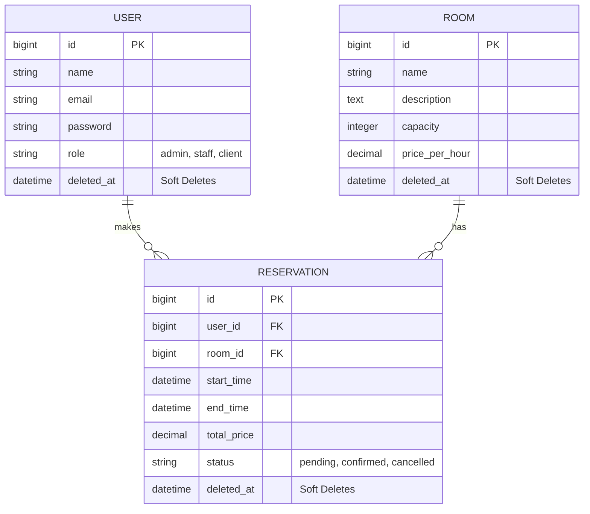

# Nexus Coworking System

Sistema avanzado para la gestión de espacios de coworking, reservas de salas y automatización de procesos administrativos.

## Requisitos Previos
- PHP >= 8.2
- Composer
- Node.js & NPM
- SQLite (Configurado por defecto)

## Instalación y Configuración
1. Clona este repositorio.
2. Copia el archivo `.env.example` a `.env` y configura las credenciales de Mailtrap.
3. Ejecuta `composer install`.
4. Ejecuta `php artisan key:generate`.
5. Ejecuta `php artisan migrate --seed`.
6. Ejecuta `npm install` y `npm run dev`.

## Credenciales de Prueba (Seeding)
- **Admin:** admin@nexus.com / password
- **Staff:** staff@nexus.com / password
- **Client:** client@nexus.com / password

## Diagrama Entidad-Relación (DER)


## Tareas Programadas (Cron)

El sistema incluye un comando programado que envía recordatorios de reserva cada día a las 8:00 AM.

Para activarlo, agrega esta línea al crontab del servidor:

```
* * * * * cd /ruta/del/proyecto && php artisan schedule:run >> /dev/null 2>&1
```

Puedes probar el comando manualmente con:

```
php artisan reservations:send-reminders
```

## Estrategia de Commits (Historial Requerido)
Para cumplir con los requisitos del proyecto (mínimo 10 commits lógicos), se ha estructurado el desarrollo de la siguiente manera:

1. `feat: init laravel project with breeze, database sqlite and core models (Rooms, Reservations)`
2. `feat: implement Rooms CRUD and soft deletes logic`
3. `feat: implement Reservations logic with overlap validation`
4. `feat: add AdminMiddleware and role-based access control`
5. `ui: integrate professional design for dashboard and views`
6. `feat: install and configure barryvdh/laravel-dompdf`
7. `feat: generate PDF receipt for confirmed reservations`
8. `feat: configure Mailtrap and send PDF receipt via Email on creation`
9. `feat: implement task scheduling command for daily reminders`
10. `docs: update README, add ERD and final project polish`

---
*Desarrollado para el proyecto final de Arquitectura y Automatización.*
